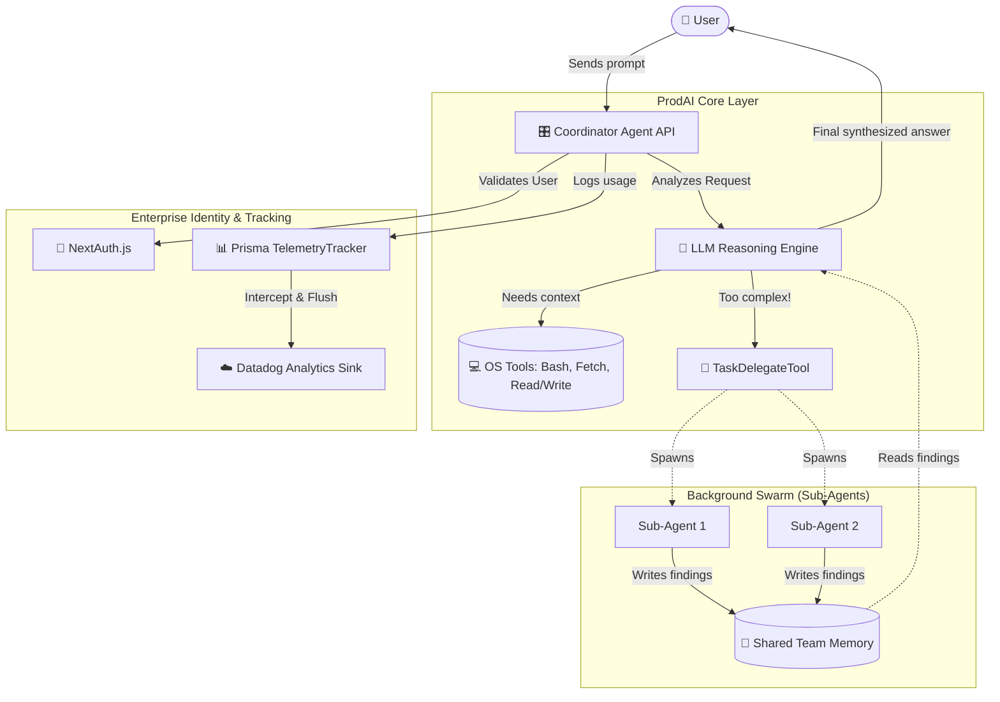

# 🚀 ProdAI Agent Platform 

[](https://github.com/ellerbrock/open-source-badges/)
[](https://opensource.org/licenses/MIT)

ProdAI Agent Platform is a production-ready, highly sophisticated AI Agent framework built from the ground up using **Next.js** and the **Vercel AI SDK**. 

Inspired by advanced CLI agents like Claude Code, this project transforms the concept of an autonomous reasoning loop into a robust web application. It features a complete multi-agent Swarm Architecture, enterprise-grade telemetry, Model Context Protocol (MCP) integrations, and native Host OS tooling capabilities.
---
## 🆚 How is this different from a "Normal" AI?

Most AI wrapper templates simply take your text, send it to OpenAI, and stream back the text. **ProdAI is fundamentally different.** It simulates a workforce rather than a chatbot.

| Feature | Standard AI Chatbot | **ProdAI Agent** 🚀 |
| :--- | :--- | :--- |
| **Autonomy** | Stops and waits after 1 output | Thinks, acts, reads, and iterates automatically (up to 5 loops) |
| **Tools** | Maybe a web search | Has native access to OS `Bash`, `Filesystem`, and `160+ tools` |
| **Architecture** | Single Thread | **Swarm-based**. The main agent spawns parallel Sub-Agents |
| **State sharing** | Passes entire message history | Agents communicate efficiently via a shared `TeamMemory` NoSQL-like store |
| **Tracking** | None | Fully intercepted telemetry, pushing analytics to Prisma/Datadog |
| **Identity** | Anonymous | Walled off by NextAuth isolated sessions natively |
<br/>
## 🏗️ Architecture Visualization
Here is a visual representation of how the Coordinator Agent handles a complex user request by delegating work to the Swarms and tracking it all natively:



---

## ✨ Key Technical Features

### 🧠 The Core Intelligence
- **Vercel AI SDK Integration**: Built precisely on top of `@ai-sdk/react` and `@ai-sdk/openai`, utilizing highly optimized text-streaming interfaces.
- **Autonomous Tool Reasoning**: The core Coordinator Agent is capable of identifying, dispatching, and analyzing multiple parallel tool calls natively (`maxSteps: 5`) without requiring user intermediation.

### 🛠️ Advanced Execution Layer
- **Local Host Access**: Native system access including `BashTool`, `FileReadTool`, and `FileWriteTool` to mutate its surrounding environment.
- **Network & Exploration Tools**: Incorporates utilities like `WebFetchTool`, `GlobTool`, and `GrepTool` allowing the AI to scrape pages and search entire repositories.
- **MCP Extensibility Base**: Integrates a dynamic `MCPClient` and `MCPToolAdapter` allowing the agent to connect to any external Model Context Protocol plugin.

### 📊 Enterprise Telemetry & Identity 
- **Prisma ORM Tracking**: Fully persists token usage stats and tool execution analytics into a local SQLite `/ PostgreSQL` database natively.
- **NextAuth Isolation**: Includes `next-auth` interceptors to natively attach tracking and conversation context to specific authenticated Users.

---

## 🚀 Getting Started
To run this open-source AI platform locally:
1. **Clone the repository:**
   ```bash
   git clone https://github.com/yourusername/ai-agent-web.git
   cd ai-agent-web
   ```

2. **Install dependencies:**
   ```bash
   npm install
   ```

3. **Configure Environment Variables:**
   Create a `.env.local` file in the root of the project:
   ```env
   OPENAI_API_KEY="sk-..."
   AUTH_SECRET="supersecret-random-hash" # For NextAuth
   ```

4. **Initialize the Database:**
   Deploy the telemetry and session schemas via Prisma:
   ```bash
   npx prisma db push
   npx prisma generate
   ```

5. **Start the development server:**
   ```bash
   npm run dev
   ```

## 💻 How to Use
When you open the web interface, you are dropped into a chat session with the **Coordinator Agent**:

- **Ask it to explore:** Provide it a query such as _"Can you list files in the `/src` folder out for me?"_ — the agent will autonomously spawn a background Bash tool to accomplish this and review the response.
- **Ask it to do complex tasks:** _"Analyze the code inside `route.ts`, write a summary of it to Team Memory, and then fetch the main webpage of Vercel."_ — watch the Coordinator spin up Sub-Agents and execute complex commands while streaming responses.

## 🤝 Contributing (Open Source)
This project is actively welcoming contributors! 
**Areas to contribute:**
- Adding new Tools inside `src/tools/implementations/`.
- Building interactive Frontend Dashboard visuals for the Prisma Telemetry tracker.
- Adding connections to official [Model Context Protocol Integrations](https://github.com/modelcontextprotocol/servers).
**To submit code:**
1. Fork the Project
2. Create your Feature Branch (`git checkout -b feature/AmazingTool`)
3. Commit your Changes (`git commit -m 'Add some AmazingTool'`)
4. Push to the Branch (`git push origin feature/AmazingTool`)
5. Open a Pull Request

## 📜 License
Distributed under the MIT License. See `LICENSE` for more information.
